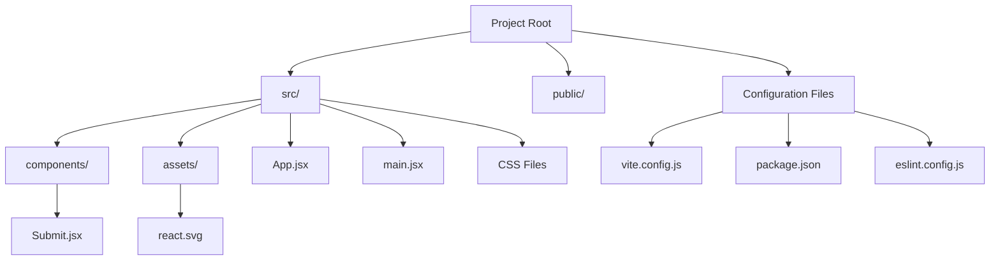
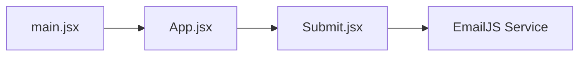
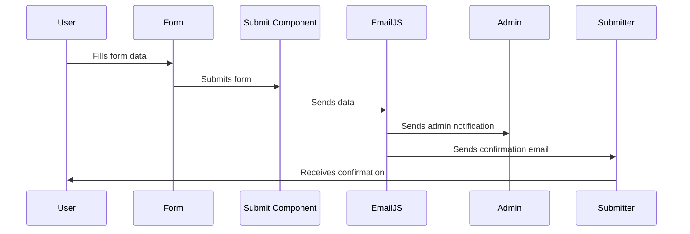

# Submission Form Project Documentation

This documentation provides an overview of the Submission Form project, which is a React-based web application built with Vite that handles form submissions with email notifications.

## Project Overview

The project is a modern web application that provides a comprehensive submission form with various input fields and email notification functionality. It uses EmailJS for handling email communications and React for the user interface.

## Technology Stack

- React 19.0.0
- Vite 6.3.1
- EmailJS
- CSS3

## Project Structure



## Component Architecture



## Form Data Flow



## Key Features

1. **Form Fields**:
   - Personal Information (First Name, Last Name, Email, Contact)
   - Gender Selection
   - Subject Selection (Multiple choices)
   - Resume Upload
   - URL Input
   - Specialization Selection
   - About Section

2. **Email Notifications**:
   - Admin notification with detailed form submission
   - User confirmation email with submission summary

3. **Form Validation**:
   - Required field validation
   - Email format validation
   - URL format validation

## Configuration

The project uses several configuration files:

1. **vite.config.js**: Configures the development server
   - Port: 4000 (default)
   - Allows external network access
   - Configured for React

2. **EmailJS Configuration**:
   - Service ID: service_zh0qpyx
   - Admin Template ID: template_vj19kbk
   - User Welcome Template ID: template_id7e6gd

## Styling

The application uses custom CSS with:
- Responsive design
- Form layout optimization
- Success/Error message styling
- Custom button styling
- Fieldset organization

## Development Setup

1. Install dependencies:
```bash
npm install
```

2. Start development server:
```bash
npm run dev
```

3. Build for production:
```bash
npm run build
```

## Best Practices

- Form state management using React hooks
- Proper error handling and user feedback
- Email service abstraction
- Responsive design implementation
- Loading state management during submission

## Future Enhancements

1. Add form data validation library
2. Implement file size validation for resume upload
3. Add progress tracking for form submission
4. Implement form data persistence
5. Add more customizable email templates